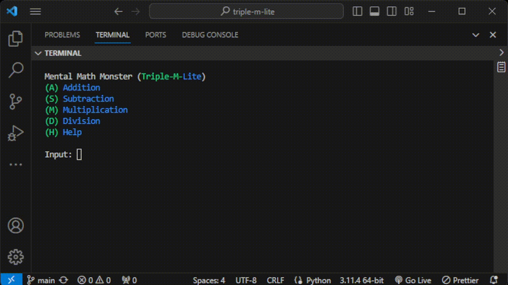

# Triple-M-Lite

Practice your mental math skills in the terminal.

## Usage
- Clone the repository 
- Open terminal and navigate to the cloned repository
- To run the program type the command  `python main.py`